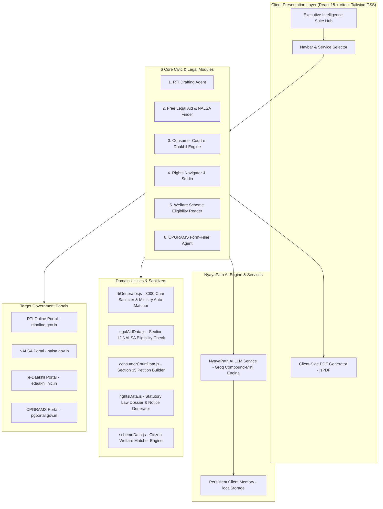

# NyayaPath AI - Civic & Legal Empowerment Platform

NyayaPath AI is an advanced AI-powered civic technology platform designed to help citizens understand and act on their civic and statutory legal rights. By translating complex legal jargon, government notices, and scattered portal procedures into guided, portal-compliant action paths, NyayaPath AI democratizes access to justice and government transparency across India.

---

## 🏛️ System Architecture



---

## 📁 Directory Structure

```text
civic-rights-ai/
├── public/
│   └── favicon.ico
├── src/
│   ├── components/
│   │   ├── ConsumerCourtEngine.jsx   # Section 35 e-Daakhil Consumer Petition Generator
│   │   ├── GrievanceFormFiller.jsx   # Conversational CPGRAMS Grievance Interviewer
│   │   ├── LegalAidFinder.jsx        # NALSA Section 12 Free Lawyer Eligibility & DLSA App
│   │   ├── Navbar.jsx                # Header Navigation & Executive Service Switcher
│   │   ├── RightsNavigator.jsx       # Visual Legal Rights Studio & Demand Notice Generator
│   │   ├── RtiChatbotAssistant.jsx   # AI Assistant for RTI Query Refinement
│   │   ├── RtiDraftingAgent.jsx      # DoPT rtionline.gov.in Compliant RTI Generator
│   │   ├── SchemeEligibilityReader.jsx# Central/State Welfare Scheme Profile Matcher
│   │   └── ServiceHub.jsx            # Executive Intelligence Suite Landing Hub
│   ├── services/
│   │   └── groqApi.js                # Groq LLM API Service & Fallback Handler
│   ├── utils/
│   │   ├── consumerCourtData.js      # Consumer Protection Act 2019 Petition Templates
│   │   ├── legalAidData.js           # NALSA Act 1987 Section 12 Rules & DLSA Templates
│   │   ├── rightsData.js             # Statutory Laws, Case Strength & Notice Generators
│   │   ├── rtiGenerator.js           # rtionline.gov.in Regex Sanitizer & Ministry Rules
│   │   └── schemeData.js             # Welfare Scheme Database & Evaluation Logic
│   ├── App.jsx                       # Main Application Root & Router State
│   ├── index.css                     # Tailwind CSS & Global Styling Rules
│   └── main.jsx                      # Vite React Mounting Point
├── .env                              # Environment Variables (API Keys)
├── .gitignore                        # Git Ignored Files & Secrets Protection
├── index.html                        # HTML5 Entry Point
├── package.json                      # Project Dependencies & Build Scripts
├── postcss.config.js                 # PostCSS Configuration
├── tailwind.config.js                # Tailwind CSS Design System Config
├── vite.config.js                    # Vite Build Configuration
└── README.md                         # Project Documentation
```

---

## 🌟 Key Modules & Capabilities

### 1. RTI (Right to Information) Drafting Agent (`rtionline.gov.in`)
- **Strict Portal Compliance**: Sanitizes query text to adhere strictly to the 3,000-character limit and allowed character set (`A-Z, a-z, 0-9, , . - _ ( ) / @ : & ? \ %`) enforced by DoPT on `rtionline.gov.in`.
- **Smart Ministry Auto-Matching**: Automatically maps queries (*ration card, road repair, pension delay, water supply*) to competent Central Ministries.
- **Line Break Preservation**: Formats text into distinct section blocks (`APPLICATION UNDER SECTION 6(1)`, `SUBJECT`, `SPECIFIC INFORMATION SOUGHT`) for easy pasting into portal forms.
- **Compliant PDF Export**: Downloads PDFs named according to portal rules (under 12 alphanumeric characters with no spaces).

### 2. Free Legal Aid & NALSA Advocate Finder (`nalsa.gov.in`)
- **Statutory Section 12 NALSA Act Check**: Evaluates entitlement for a 100% Free Assigned Lawyer for women, SC/ST members, industrial workers, PWDs, human trafficking/disaster victims, under-trial prisoners, and low-income citizens (< ₹3,00,000 p.a.).
- **DLSA Application Generator**: Auto-drafts formal advocate assignment applications for submission to District Legal Services Authorities (DLSA) inside court complexes.

### 3. Consumer Court e-Daakhil Complaint Engine (`edaakhil.nic.in`)
- **Section 35 Petition Generator**: Converts e-commerce refund refusals, defective appliances, flight cancellation disputes, and builder delay complaints into official petitions under the Consumer Protection Act, 2019.
- **Itemized Monetary Claim Calculator**: Computes product refund, interest, compensation for mental agony, and litigation expenses into a clear claim total.

### 4. Rights Navigator & Visual Legal Rights Studio
- **No-Chatbot Visual Studio**: Interactive parameters studio featuring claim sliders, delay duration controls, and evidence availability toggles.
- **Dynamic Case Strength Meter**: Displays a 0-100% visual circular gauge evaluating legal grounds.
- **Pre-Litigation Demand Notice Generator**: Generates 15-day formal legal demand notices for landlords, employers, or sellers.

### 5. Welfare Scheme Eligibility Reader
- **Instant Profile Matching**: Evaluates citizen income, age, occupation, and state against schemes like Ayushman Bharat, PM-KISAN, e-Shram, PM Awas Yojana, and Sukanya Samriddhi.
- **Document Checklists**: Provides exact document requirements and direct portal application links.

### 6. CPGRAMS Public Grievance Form-Filler (`pgportal.gov.in`)
- **AI Interviewer Agent**: Interactively guides citizens to collect department details, reference numbers, and desired remedies.
- **Auto-Populates CPGRAMS Format**: Generates structured complaint text ready for registration on `pgportal.gov.in`.

---

## 🛠️ Tech Stack

- **Frontend**: React 18 + Vite
- **Styling**: Tailwind CSS + Lucide React Icons
- **AI Engine**: Groq LLM API (`groq/compound-mini` with automatic candidate model failover)
- **Client Memory**: Persistent `localStorage` state for chat sessions
- **Document Export**: jsPDF (for client-side PDF generation)

---

## ⚡ Quick Start

### 1. Clone the repository
```bash
git clone https://github.com/Kusagra9308/NyayaPathAI.git
```

### 2. Navigate to the project directory
```bash
cd NyayaPathAI
```

### 3. Install dependencies
```bash
npm install
```

### 4. Configure Environment Variables
Create a `.env` file in the root directory:
```env
VITE_GROQ_API_KEY=your_groq_api_key_here
```

### 5. Run the development server
```bash
npm run dev
```

Open [http://localhost:5173](http://localhost:5173) (or `http://localhost:5174`) in your browser.

---

## 📜 License

Distributed under the MIT License. See `LICENSE` for more information.
